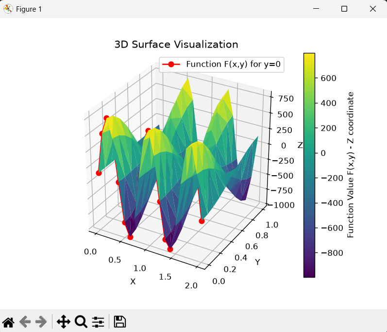
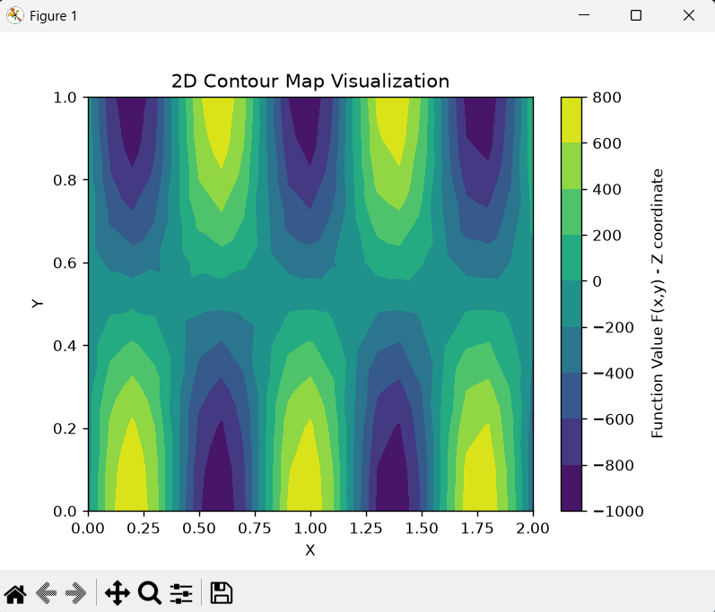
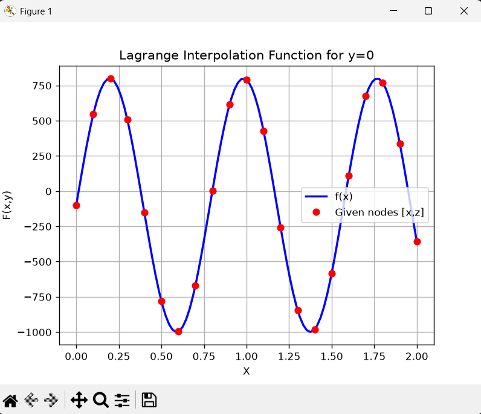
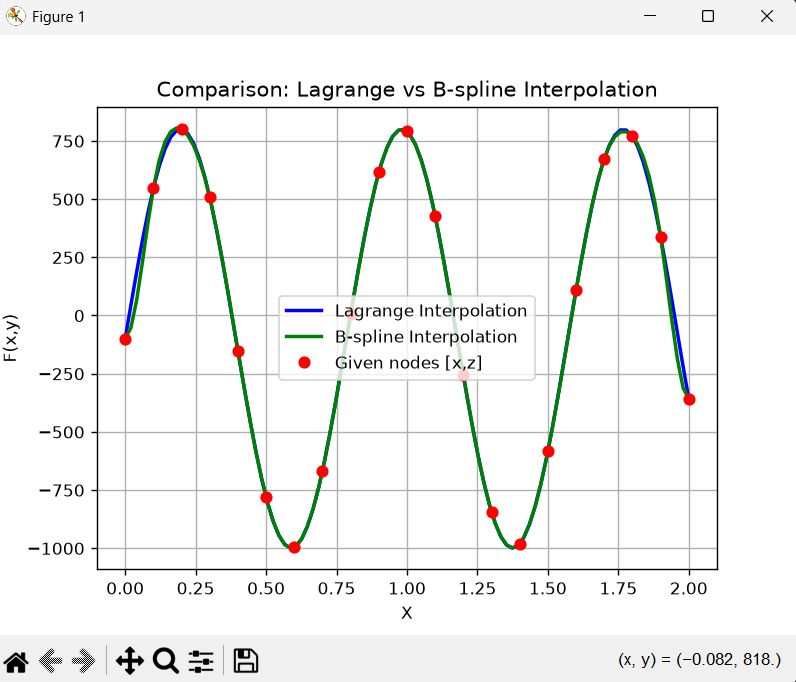
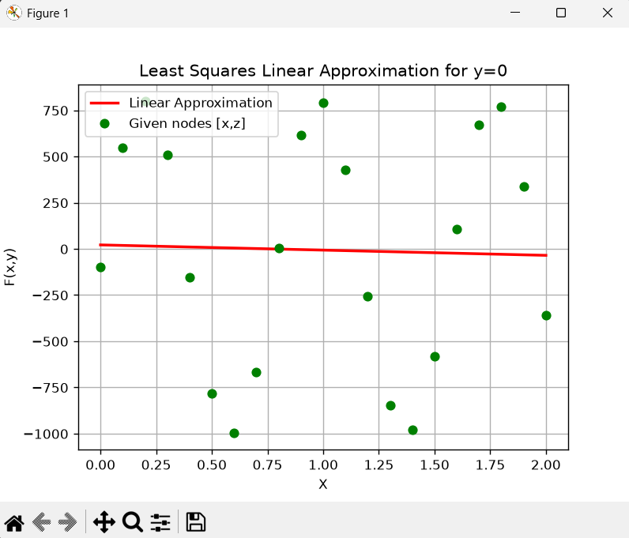
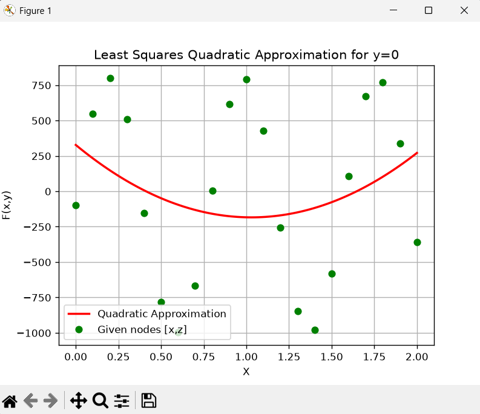
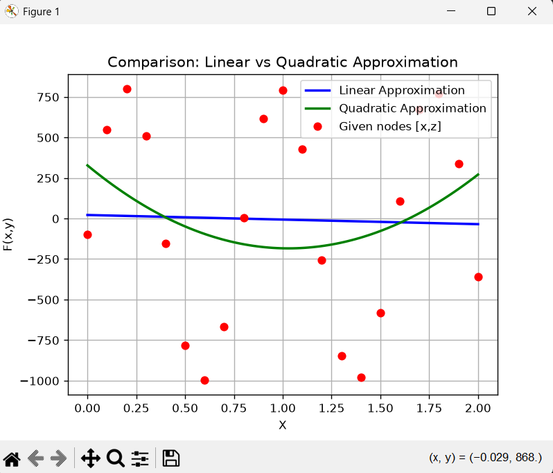
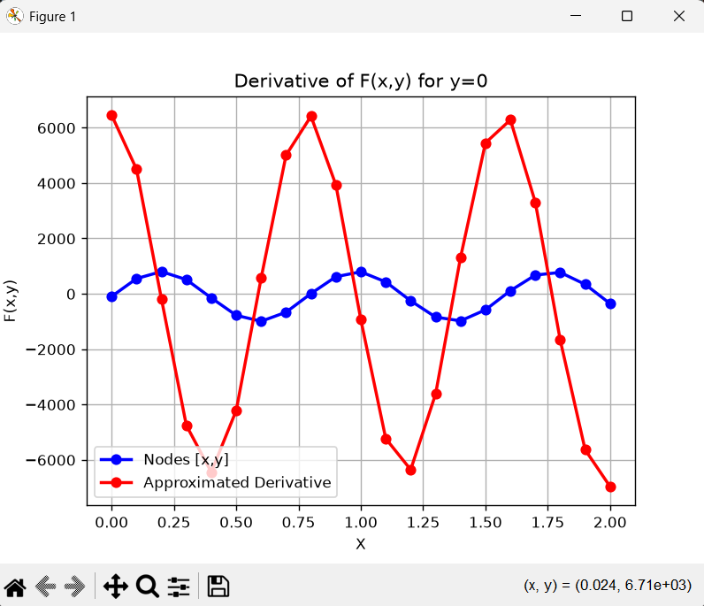
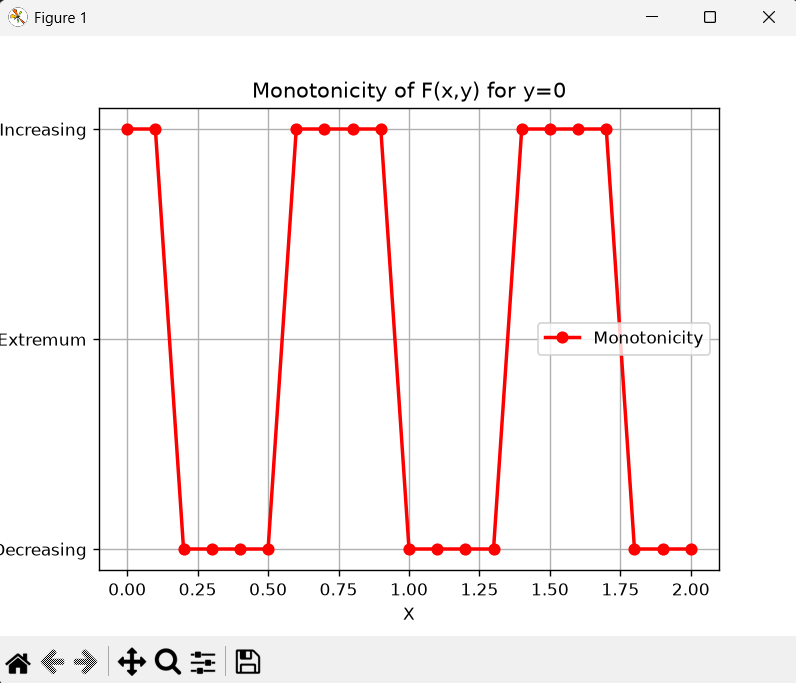

# Numerical Algorithms Analysis

This repository contains the final project for the Numerical Algorithms course, originally authored by Piotr Szczerbiak. The project focuses on mathematical data processing, spatial visualization, and the implementation of various numerical methods from scratch.

## Project Overview

The core purpose of this project is to analyze a spatial dataset (representing a function of two variables) and perform a series of numerical operations on a selected cross-section of the data. The cross-section for `y=0` was specifically chosen for all advanced calculations.

## Key Features

*   **Data Visualization**: Generates a 2D contour map and a 3D surface plot of the dataset. 
*   **Statistical Analysis**: Calculates the mean, median, and standard deviation for the given data.
*   **Surface Area Calculation**: Computes the total surface area of the 3D plot by dividing the space into triangles and summing their areas.
*   **Gaussian Elimination**: Implements a custom function to solve systems of linear equations, which is heavily utilized in subsequent approximation and B-spline calculations.
*   **Derivatives**: Calculates first-degree derivatives to evaluate the rate of change, utilizing one-sided derivatives at the boundary nodes.
*   **Monotonicity Analysis**: Evaluates and visualizes the monotonicity of the function, categorizing data points to indicate whether the function is increasing, decreasing, or constant/at an extremum.

---

## Numerical Methods Comparison

The project explores and compares multiple numerical approaches for analyzing the dataset. 

| Method Category | Implemented Algorithms | Key Observations |
| :--- | :--- | :--- |
| **Interpolation** | Lagrange Polynomial, B-spline | Lagrange interpolation fails to properly approximate the function for more than 5-6 nodes and requires splitting data into subsets. The B-spline method is significantly better and easier for datasets with a large number of nodes. |
| **Approximation** | Least Squares (Linear & Quadratic) | Both linear and quadratic functions attempt to run between the nodes. The quadratic function provides a slightly closer fit, though neither fully captures the exact shape of the approximated function. |
| **Integration** | Rectangle Method, Simpson's Method | Both methods are applied to the interpolated and approximated functions. While differences between them are very small for a fine division, Simpson's method provides results closer to the correct solution. |

---

## Visualizations

Here are the plots generated by the algorithm:

### 3D Surface and 2D Contour Map

### Interpolation for y=0

### Approximation for y=0

### Derivative and Monotonicity for y=0

